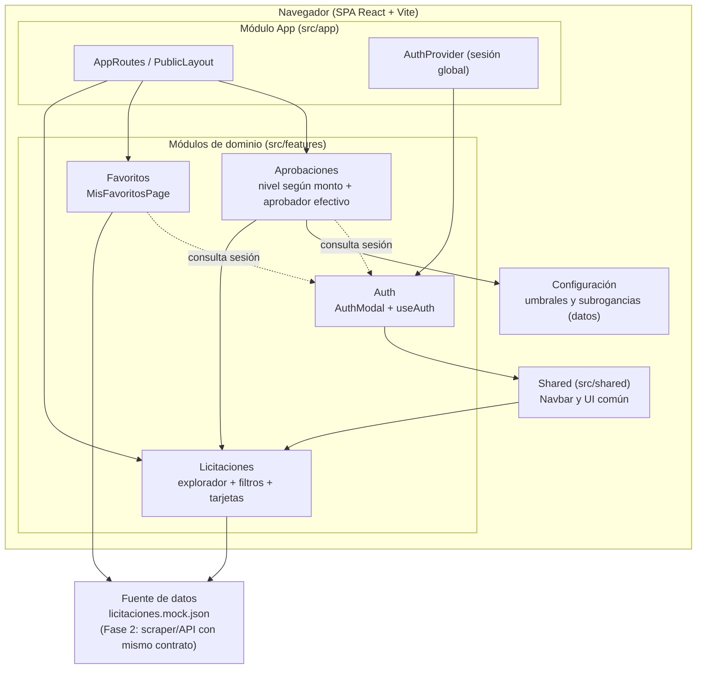

# Diseño Arquitectónico — LicitacionesUV

## 1. Estilo Arquitectónico

**Estilo adoptado:** Aplicación monolítica de cliente (**SPA**) en React, con **descomposición modular Feature-Driven** (módulos por dominio de negocio en capas: `pages` → `components` → `hooks` → `data`).

### Justificación basada en REF priorizados

| REF ID | Descripción                                      | Prioridad | Cómo lo aborda el estilo                                                                                                                                                                                                                 |
| ------ | ------------------------------------------------ | --------- | ---------------------------------------------------------------------------------------------------------------------------------------------------------------------------------------------------------------------------------------- |
| REF-01 | Resultados filtrados en menos de 2 segundos      | Alta      | Al ser una SPA, el filtrado se ejecuta localmente en el cliente (hook `useLicitacionFilters`) sin viajes al servidor ni recargas de página; el cambio de filtros re-renderiza solo la lista.                                             |
| REF-02 | Autenticación obligatoria para acciones privadas | Alta      | Existe un módulo de **Autenticación** aislado (`features/auth`) que expone el estado de sesión global (`AuthProvider` + `useAuth`); el resto de los módulos consulta la sesión antes de habilitar acciones privadas (favoritos, perfil). |
| REF-03 | Secretos nunca versionados                       | Alta      | La arquitectura cliente no embebe secretos en el bundle: la configuración sensible se gestiona vía variables de entorno documentadas en `.env.example` y excluidas por `.gitignore`.                                                     |
| REF-04 | Disponibilidad ≥ 99% en horario laboral          | Alta      | Un monolito de cliente compila a archivos estáticos desplegables en CDN/hosting estático, eliminando en la Fase 1 dependencias de servidores de aplicación que puedan caer; la disponibilidad depende solo del hosting estático.         |

### Explicación textual

El estilo SPA con módulos Feature-Driven es adecuado porque el producto es, en esencia, un **explorador de información con búsqueda y filtrado intensivo**: el valor (velocidad de consulta, REF-01) se obtiene ejecutando el filtrado en el cliente. La organización por _features_ de dominio (`licitaciones`, `auth`, `favoritos`) mantiene **responsabilidad única y bajo acoplamiento** (REF-06), y permite incorporar la Fase 2 (scraper/API) como un nuevo módulo proveedor de datos **sin rediseñar los existentes** (REF-10), porque los módulos consumen contratos de datos y no la fuente concreta.

Todos los REF de prioridad Alta quedan abordados: rendimiento (filtrado en cliente), seguridad de acciones privadas (módulo Auth con sesión global), protección de secretos (variables de entorno fuera del bundle) y disponibilidad (despliegue como estáticos).

## 2. Diagrama de Arquitectura

## 3. Descomposición Modular

**Fundamentación:** la descomposición sigue el criterio de **dominio de negocio** (cada feature agrupa lo que cambia por la misma razón) más un módulo transversal `shared` para UI común y un módulo `app` para composición (rutas, layouts y providers globales). Esto minimiza el acoplamiento: los módulos se comunican por interfaces explícitas (hooks y props) y no acceden a los internos de otro feature.

### Módulo 1: App (composición)

- **Responsabilidad:** definir el enrutamiento, el layout público y los providers globales de la aplicación.
- **Ofrece a otros módulos:** el árbol de rutas que monta cada feature, el layout base y el contexto de sesión (`AuthProvider`).
- **Depende de:** módulos de dominio (para montar sus páginas) y `shared`.

### Módulo 2: Autenticación (`features/auth`)

- **Responsabilidad:** gestionar la identidad del usuario: registro, inicio de sesión (incluido social simulado) y exposición del estado de sesión.
- **Ofrece a otros módulos:** hook `useAuth` (sesión actual, login, logout, registro) y componente `AuthModal`.
- **Depende de:** `app` (providers) y `shared` (componentes de UI comunes).

### Módulo 3: Licitaciones (`features/licitaciones`)

- **Responsabilidad:** explorar, listar y filtrar licitaciones; formatear montos y fechas; mantener el estado de filtros sincronizado con la URL.
- **Ofrece a otros módulos:** página `LicitacionesExplorerPage`, componentes `LicitacionCard`, `LicitacionList`, `FilterSidebar` y hook `useLicitacionFilters`; el contrato de datos de una licitación (`id`, `titulo`, `institucion`, `monto`, `moneda`, `fechaCierre`, `tipo`, `region`).
- **Depende de:** `app` (rutas/layout) y `shared` (Navbar). No depende de Auth ni Favoritos.

### Módulo 4: Favoritos (`features/favoritos`)

- **Responsabilidad:** permitir al usuario guardado y revisar licitaciones de interés (requiere sesión).
- **Ofrece a otros módulos:** página `MisFavoritosPage`.
- **Depende de:** Autenticación (verifica sesión antes de operar) y del contrato de datos de Licitaciones para mostrar el detalle guardado.

### Módulo 5: Shared (`src/shared`)

- **Responsabilidad:** proveer UI transversal (p. ej. `Navbar` con estado dinámico de sesión) reutilizable por todos los features.
- **Ofrece a otros módulos:** componentes comunes sin lógica de dominio.
- **Depende de:** Autenticación (para mostrar avatar/botón de login según sesión); ningún feature depende de él de forma cíclica.

### Módulo 6: Aprobaciones (`features/aprobaciones`)

- **Responsabilidad:** gestionar el flujo de aprobación de licitaciones: determinar el nivel requerido según monto y unidad, resolver el aprobador efectivo considerando subrogancias vigentes, y registrar las decisiones.
- **Ofrece a otros módulos:** consulta de "¿quién aprueba y en qué nivel?" para una licitación, y registro de decisiones de aprobación.
- **Depende de:** Licitaciones (datos de la licitación y su monto), Autenticación (identidad del usuario que aprueba) y la configuración del sistema (umbrales y delegaciones tratados como datos). No depende de Favoritos.

## 4. Decisiones de Diseño

### Decisión 1: SPA con datos mock y contrato estable para la Fase 2

- **Decisión:** implementar la Fase 1 como SPA que consume `licitaciones.mock.json`, manteniendo un contrato de datos que luego será reemplazado por el scraper/API real.
- **Motivación:** REF-01 (respuesta < 2 s sin latencia de red) y REF-10 (migrar a datos reales sin rediseñar módulos).
- **Alternativas consideradas:** MPA tradicional (descartada: recargas completas y peor rendimiento percibido); SSR con Next.js (descartada: complejidad y dependencias innecesarias para la Fase 1 y el tamaño del equipo).
- **Impacto:** módulos Licitaciones, Favoritos y App; habilita REF-08 (SPA en navegadores modernos).

### Decisión 2: Sesión global con Context API propia

- **Decisión:** gestionar la sesión con `AuthProvider` + hook `useAuth` (Context API de React, estado en memoria).
- **Motivación:** REF-02 (todas las acciones privadas deben consultar autenticación) con la menor complejidad posible; evita dependencias externas y permite al `Navbar` reaccionar a la sesión.
- **Alternativas consideradas:** Redux/Zustand (descartadas: sobredimensionado para un solo estado global); persistencia en `localStorage` (pospuesta: requiere backend real de sesiones en la Fase 2).
- **Impacto:** módulos Auth, Shared (Navbar) y Favoritos (guardas de sesión).

### Decisión 3: Filtros sincronizados con la URL

- **Decisión:** el estado de búsqueda y filtrado vive en la URL (`useSearchParams`), que actúa como única fuente de verdad; los parámetros vacíos se limpian automáticamente.
- **Motivación:** REF-05 (usabilidad: enlaces compartibles, botón atrás/adelante funcional y resultados reproducibles) y REF-01 (aplicación inmediata del filtro en cliente).
- **Alternativas consideradas:** estado interno con `useState` (descartado: no compartible ni recuperable); librería de estado de URL externa (descartada: `useSearchParams` ya cubre el caso).
- **Impacto:** módulo Licitaciones (FilterSidebar + useLicitacionFilters + ExplorerPage).

### Decisión 4: Organización Feature-Driven del código

- **Decisión:** agrupar el código por dominio (`features/licitaciones`, `features/auth`, `features/favoritos`) con capas internas `pages/components/hooks/data`, dejando lo transversal en `shared` y la composición en `app`.
- **Motivación:** REF-06 (responsabilidad única, bajo acoplamiento y verificación con ESLint) y REF-10 (agregar el scraper como nueva fuente de datos sin tocar los features existentes).
- **Alternativas consideradas:** organización por tipo de archivo (carpetas globales de componentes/hooks; descartada: alto acoplamiento y difícil de escalar por dominio).
- **Impacto:** todos los módulos; define la convención de ramas y PRs del equipo (REF-11).

### Decisión 5: Línea base reproducible con verificación única

- **Decisión:** comando integrador `npm run verify` (clean + lint + format:check + test + build), dependencias con SemVer explícito, `package-lock.json`, `.env.example` y Prettier obligatorio.
- **Motivación:** REF-07 (cualquier integrante levanta y valida el proyecto con un comando) y REF-03 (secretos fuera del repositorio desde la línea base).
- **Alternativas consideradas:** Gradle wrapper (no aplica a JavaScript); scripts manuales sueltos (descartados: no reproducibles ni verificables en PR).
- **Impacto:** tooling del repositorio completo y flujo de PR del equipo (REF-11).

### Decisión 6: Umbrales de aprobación como datos configurables, no constantes

- **Decisión:** los rangos de monto que determinan el nivel de aprobación (jefe de unidad / dirección económica / rectoría) se modelan como datos de configuración por unidad (entidad `UmbralAprobacion`) y no como constantes en el código.
- **Motivación:** REF de mantenibilidad del CR-302 (regla R4: "la normativa cambia y los umbrales se actualizan"). Mantenerlos como datos permite ajustar los montos y niveles sin recompilar ni redeploy.
- **Alternativas consideradas:** fijar los umbrales como constantes hardcodeadas en el módulo (descartada: requiere cambios de código y nuevo despliegue ante cada cambio de normativa); configuración global única (descartada: no permite las variantes por facultad/unidad de la regla R2).
- **Impacto:** módulo Aprobaciones (consume `UmbralAprobacion`), módulo Configuración/Datos (los provee) y las futuras HU de administración de umbrales.

### Decisión 7: Resolución del aprobador efectivo como regla centralizada

- **Decisión:** la determinación de quién aprueba (titular o subrogante vigente según la fecha de la solicitud, entidad `Delegacion`) se implementa como una regla única dentro del módulo Aprobaciones, expuesta como servicio de consulta.
- **Motivación:** REF de confiabilidad del CR-302 (regla R3: las delegaciones tienen fecha de inicio y término y pueden cambiar). Centralizarla garantiza que todas las vistas consulten el mismo criterio y evita contradicciones entre el titular y el subrogante.
- **Alternativas consideradas:** resolver el aprobador efectivo en cada vista/componente (descartada: criterio duplicado y difícil de mantener/auditar); cachear la delegación vigente en el cliente (descartada: riesgo de aprobar con un delegado que ya venció).
- **Impacto:** módulo Aprobaciones (servicio de consulta "¿quién aprueba y en qué nivel?"), módulo de datos (entidades `Delegacion` y `Aprobacion`) y las vistas de bandeja de aprobaciones.

## 5. Trazabilidad REF ↔ Módulos ↔ HU

| REF (Alta)                  | Módulo que lo aborda                                      | HU relacionadas     |
| --------------------------- | --------------------------------------------------------- | ------------------- |
| REF-01 Rendimiento          | Licitaciones (filtrado en cliente)                        | US-03, US-04        |
| REF-02 Seguridad (sesión)   | Autenticación + Favoritos                                 | US-01, US-02, US-06 |
| REF-03 Seguridad (secretos) | Línea base del repositorio (`.env.example`, `.gitignore`) | Transversal         |
| REF-04 Disponibilidad       | Estilo SPA desplegable como estáticos                     | Transversal         |
| REF-Alta Mantenibilidad (umbrales)  | Aprobaciones + Configuración (Decisión 6)          | US-10               |
| REF-Alta Confiabilidad (auditoría)  | Aprobaciones (Decisión 7)                          | US-09, US-11        |
