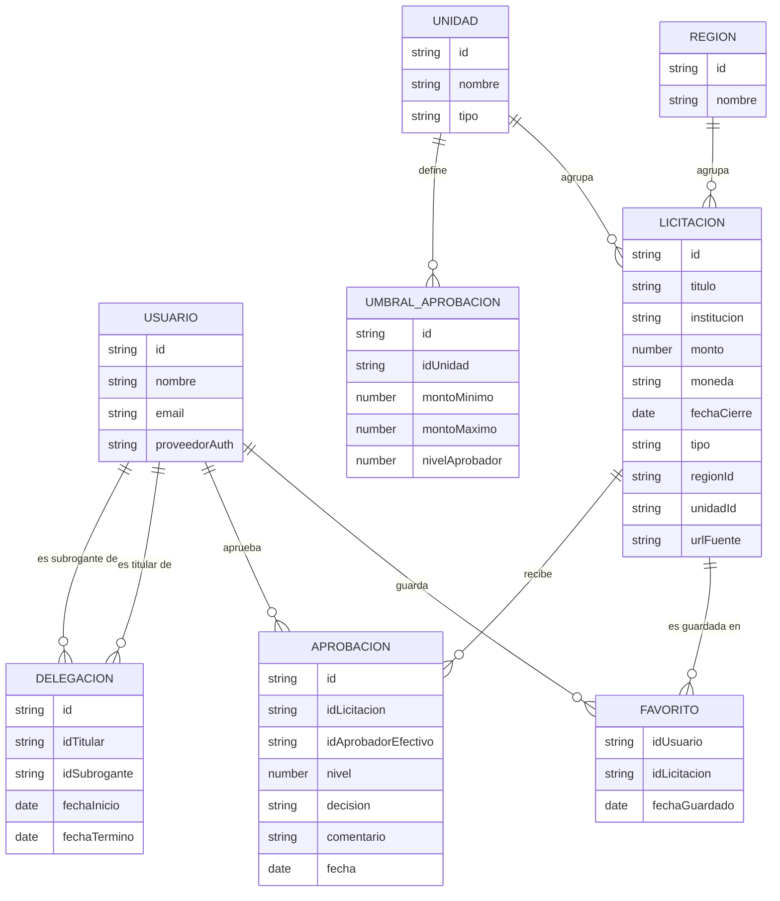

# 🏛️ LicitacionesUV: Plataforma de Filtrado y Centralización de Licitaciones

Plataforma web desarrollada en **React + Vite** diseñada para centralizar, filtrar y optimizar la búsqueda de oportunidades comerciales y licitaciones publicadas por empresas privadas, recopiladas de forma automatizada mediante técnicas de web scraping.

---

## 📌 Descripción del sistema

### ¿Qué es?

Es una solución web que reúne en un único punto de acceso las licitaciones y oportunidades de contratación publicadas por diversas empresas privadas. El sistema procesa y categoriza los datos para que proveedores y organizaciones encuentren oportunidades relevantes de manera rápida, accediendo directamente a la fuente oficial de cada convocatoria.

### ¿Qué problema resuelve?

Actualmente, la información de compras y contrataciones privadas se encuentra dispersa en múltiples plataformas y sitios corporativos. Esto genera:

- Pérdida de tiempo en revisiones manuales diarias.
- Riesgo de omitir convocatorias estratégicas con fechas límite próximas.
- Sobrecarga de información no relevante para el rubro específico de cada empresa.

### ¿Cómo funciona?

1. **Recolección:** Un scraper extrae periódicamente los datos públicos de portales autorizados (empresa convocante, fechas de apertura y cierre, rubro, ubicación, bases y enlaces oficiales).
2. **Filtrado y Procesamiento:** La plataforma clasifica las licitaciones por sector, palabras clave, fechas y montos estimados.
3. **Visualización y Gestión:** A través de la interfaz web, el usuario filtra, prioriza y hace seguimiento de las convocatorias que se ajustan a su perfil de negocio.

---

## 🧭 Historias de Usuario

Todas las historias están registradas como GitHub Issues.

| ID    | Nombre                                                | Issue               |
| ----- | ----------------------------------------------------- | ------------------- |
| US-01 | Registrarse en la plataforma                          | #16                 |
| US-02 | Iniciar sesión                                        | #16                 |
| US-03 | Explorar licitaciones publicadas                      | #17                 |
| US-04 | Filtrar licitaciones por palabra clave, región y tipo | #18                 |
| US-05 | Acceder a la fuente oficial de una licitación         | #17                 |
| US-06 | Guardar licitaciones en favoritos                     | — (issue por crear) |
| US-07 | Gestionar perfil de usuario                           | — (issue por crear) |
| US-08 | Recibir alertas de convocatorias de interés           | — (issue por crear) |
| US-09 | Aprobar o rechazar una licitación según el monto      | #55 (CR-302)        |
| US-10 | Configurar umbrales de aprobación por unidad          | #56 (CR-302)        |
| US-11 | Gestionar subrogancias con vigencia                   | #57 (CR-302)        |

> Cada issue mantiene el formato: `US-XX: [nombre]` + enunciado _Como [actor], quiero [acción], para [beneficio]_ + criterios de aceptación (CA1, CA2, ...).

---

## 🚦 Requisitos Extrafuncionales

Ver: [ReqExtrafuncionales.md](ReqExtrafuncionales.md)

---

## 🧱 Entidades del Dominio

| Entidad              | Descripción                                                           | Atributos principales                                                                                                                                    |
| -------------------- | --------------------------------------------------------------------- | -------------------------------------------------------------------------------------------------------------------------------------------------------- |
| **Licitación**       | Oportunidad de contratación publicada por un organismo o empresa      | `id`, `título`, `institución convocante`, `monto`, `moneda`, `fecha de cierre`, `tipo` (pública/privada), `región`, `unidad`, `url de la fuente oficial` |
| **Usuario**          | Persona registrada que consulta y sigue licitaciones                  | `id`, `nombre`, `email`, `proveedor de autenticación` (local, Google, GitHub)                                                                            |
| **Favorito**         | Licitación guardada por un usuario para seguimiento                   | `id usuario`, `id licitación`, `fecha de guardado`                                                                                                       |
| **Región**           | División territorial usada para filtrar y categorizar                 | `id`, `nombre`                                                                                                                                           |
| **Unidad**           | Unidad o facultad que agrupa licitaciones y umbrales de aprobación    | `id`, `nombre`, `tipo` (lista predefinida: facultad, dirección, rectoría)                                                                                |
| **Aprobación**       | Decisión de aprobación emitida sobre una licitación                   | `id`, `id licitación`, `id aprobador efectivo`, `nivel`, `decisión`, `comentario`, `fecha`                                                               |
| **Delegación**       | Subrogancia de un titular a un subrogante por un período determinado  | `id`, `id titular`, `id subrogante`, `fecha inicio`, `fecha término`                                                                                     |
| **UmbralAprobación** | Rango de monto que define el nivel de aprobación requerido por unidad | `id`, `id unidad`, `monto mínimo` (inclusivo), `monto máximo` (exclusivo), `nivel aprobador`                                                             |

**Relaciones:**

- Un **Usuario** guarda muchas **Licitaciones** como **Favoritos** (1:N a través de Favorito).
- Una **Licitación** pertenece a una **Región** (N:1).
- Un **Favorito** referencia exactamente a un **Usuario** y a una **Licitación**.
- Un **Usuario** aprueba muchas **Aprobaciones** (1:N).
- Una **Licitación** recibe muchas **Aprobaciones** (1:N).
- Una **Delegación** referencia a dos **Usuarios** (titular y subrogante).
- Un **UmbralAprobación** pertenece a una **Unidad** y define el nivel según rangos de monto.
- Una **Licitación** pertenece a una **Unidad** (N:1).



---

## 🖼️ Mockups

Los mockups de aprobaciones (CR-302) son prototipos HTML de baja fidelidad: se abren directamente en el navegador desde [`docs/mockups/`](docs/mockups/).

| Mockup                                      | Archivo                                                                                                        | Historia de usuario relacionada |
| ------------------------------------------- | -------------------------------------------------------------------------------------------------------------- | ------------------------------- |
| Explorador de licitaciones con tarjetas     | (Figma, por subir)                                                                                             | US-03, US-05                    |
| Panel de filtros lateral                    | (Figma, por subir)                                                                                             | US-04                           |
| Mis favoritos                               | (Figma, por subir)                                                                                             | US-06                           |
| Bandeja de aprobaciones pendientes (CR-302) | [`docs/mockups/CR-302-bandeja-aprobaciones.html`](docs/mockups/CR-302-bandeja-aprobaciones.html)               | US-09, US-11                    |
| Panel de umbrales y subrogancias (CR-302)   | [`docs/mockups/CR-302-panel-umbrales-subrogancias.html`](docs/mockups/CR-302-panel-umbrales-subrogancias.html) | US-10, US-11                    |

---

## 🏗️ Diseño Arquitectónico

Ver: [Arquitectura.md](Arquitectura.md)

La aplicación se construye como una **SPA en React** organizada bajo el enfoque **Feature-Driven** (`src/features/{licitaciones, auth, favoritos}`), con módulos compartidos en `src/shared` y configuración central de rutas en `src/app`.

---

## 👥 Responsabilidades del Equipo

| Integrante                      | Rol                                  | Ítems de la rúbrica a cargo                                                         |
| ------------------------------- | ------------------------------------ | ----------------------------------------------------------------------------------- |
| Wilson Jara (@Wilson-Jara)      | Project Manager / Analista funcional | 1.1 Historias de Usuario (Issues), README.md, coordinación y trazabilidad           |
| Vicente Garcia (@Vixoooooo19)   | Tech Lead / Arquitecto de software   | 2.1 Diseño Arquitectónico (Arquitectura.md), 2.2 Diagrama de Arquitectura           |
| Vicente Saa (@Reinald-Code)     | Frontend Developer / UI              | 2.3 Mockups (consistencia con HU)                                                   |
| Benjamin Lazo (@lazo1838k)      | Backend Developer / Integraciones    | 2.4 Entidades del dominio, 1.2 Requisitos Extrafuncionales (ReqExtrafuncionales.md) |
| Mauricio Henriquez (@MauricioH) | QA Engineer / DevOps                 | Revisión de coherencia entre artefactos (HU ↔ REF ↔ módulos ↔ mockups)              |

---

## 🚀 Metas y Escalabilidad

- [x] **Fase 1 (Actual):** Interfaz cliente en React + Vite para visualización y filtrado de licitaciones iniciales.
- [ ] **Fase 2:** Integración completa de scrapers automatizados y categorización dinámica por etiquetas.
- [ ] **Fase 3:** Sistema de alertas automáticas por correo para convocatorias de alto interés.
- [ ] **Fase 4:** Panel de estadísticas sobre tendencias de compra por sector y región.

### ⚠️ Limitaciones

- La plataforma depende de la disponibilidad y estructura pública de las fuentes de origen.
- La herramienta centraliza y organiza información, pero no reemplaza la postulación formal en el portal del convocante.

---

## 🛠️ Requisitos Previos

Para ejecutar el entorno local, necesitas:

- **Runtime:** Node.js 20.19+ o 22.12+
- **Gestor de paquetes:** npm 10+
- **Stack principal:** React 19, Vite 8, ESLint 10
- **Pruebas:** runner nativo de Node (`node --test`)
- **Editor recomendado:** Visual Studio Code

### Wrapper y línea base reproducible

Al ser un proyecto Node.js, el equivalente al wrapper `./gradlew` de Gradle es el propio `npm`, complementado con los mecanismos de reproducibilidad del proyecto:

- **`package-lock.json`:** bloquea el árbol de dependencias para installs 100% reproducibles.
- **`engines` en `package.json`:** declara las versiones mínimas de Node.js y npm requeridas.
- **SemVer explícito:** las dependencias se declaran con versión exacta (`19.2.8`, sin rangos `^`/`~`), de modo que todos los entornos usan exactamente la misma versión.

---

## ⚙️ Instalación y Puesta en Marcha

### 1. Clonar el repositorio

```bash
git clone https://github.com/Wilson-Jara/LicitacionesUV.git
cd LicitacionesUV
```

### 2. Validar versión de Node.js

```bash
node --version
npm --version
```

Si tu versión de Node.js es menor a la 20.19, actualízala antes de continuar.

### 3. Instalar dependencias

```bash
npm install
```

### 4. Comando único integrador

El proyecto expone un comando único que **limpia, verifica el formato, compila, prueba y empaqueta** (equivalente a `./gradlew clean build`):

```bash
npm run verify
```

Equivale a ejecutar en secuencia:

```bash
npm run clean        # elimina artefactos de build (dist/)
npm run lint         # análisis estático con ESLint
npm run format:check # verifica el formato unificado (falla si hay desviaciones, ideal para CI/CD)
npm run test         # pruebas con el runner nativo de Node
npm run build        # compilación y empaquetado con Vite
```

### 5. Ejecutar entorno de desarrollo

```bash
npm run dev
```

### Variables de entorno

El proyecto documenta sus variables en `.env.example`. Para configurar tu entorno local:

```bash
cp .env.example .env
```

- Cada variable está documentada con su **nombre**, **formato** y **obligatoriedad** dentro de `.env.example`.
- Los archivos `.env` reales nunca se suben al repositorio (excluidos por `.gitignore`), igual que certificados y llaves privadas (`*.pem`, `*.key`, `*.p12`, `*.pfx`).

---

## Formateo de código

El proyecto utiliza [Prettier](https://prettier.io/) para mantener un formato consistente en los archivos compatibles.

### Formatear archivos

Para aplicar automáticamente el formato:

```bash
npm run format
```

### Verificar el formato

Para comprobar que los archivos ya estén formateados sin modificarlos:

```bash
npm run format:check
```

### Configuración

La configuración se encuentra en:

- `.prettierrc`: reglas de formato del proyecto.
- `.prettierignore`: archivos y carpetas excluidos del formateo.

Antes de crear un Pull Request, ejecuta:

```bash
npm run verify
```

El comando `verify` ya incluye la verificación de formato (`format:check`), por lo que el build falla si algún archivo no cumple el formato unificado del equipo.

El formateo no debe cambiar la lógica de la aplicación, únicamente la presentación del código.

---

## 🌿 Flujo de Trabajo en Git

El proyecto usa un modelo de ramas con dos ramas permanentes:

- **`main`**: rama de producción. Contiene únicamente versiones estables y verificadas. Está protegida: nadie trabaja sobre ella directamente.
- **`develop`**: rama de integración. Aquí convergen todas las funcionalidades terminadas y revisadas. Es la base desde la que se crean todas las ramas de trabajo.

```text
main      ──────■────────────────■──────►  (solo merges de release/hotfix)
                ▲                ▲
develop       ──■──■────■───────■──────►  (integra features vía PR)
                  ▲  ▲
feat/41-…   ───────■──■──────────────►  (ramas de trabajo)
```

### Gestión de Ramas

Nunca trabajes directo sobre `main` ni sobre `develop`. Toda tarea (Issue) se desarrolla en su propia rama, creada **siempre desde `develop`**:

```bash
git checkout develop
git pull
git checkout -b feat/[numero-issue]-[descripcion-corta]
```

Convención de nombres según el tipo de tarea:

| Tipo     | Uso                                     | Ejemplo                        |
| -------- | --------------------------------------- | ------------------------------ |
| `feat/`  | Nueva funcionalidad                     | `feat/41-modo-oscuro-claro`    |
| `fix/`   | Corrección de un bug                    | `fix/25-filtro-fecha-invalido` |
| `docs/`  | Documentación                           | `docs/30-actualizar-readme`    |
| `chore/` | Tareas de mantenimiento o configuración | `chore/8-actualizar-gitignore` |

### Registro de Cambios (Commits)

Usa mensajes atómicos e imperativos que describan el efecto del cambio, no el archivo modificado:

```bash
git add .
git commit -m "Agrega boton de alternancia de tema oscuro y claro"
```

### Publicación y Pull Request

Publica la rama y abre el Pull Request **hacia `develop`** (nunca hacia `main`):

```bash
git push -u origin feat/[numero-issue]-[descripcion-corta]
```

El PR debe incluir: propósito, resumen de cambios, cómo se verificó y el Issue que cierra:

```text
Closes #[número_issue]
```

> **Regla:** El Pull Request requiere la revisión y aprobación de al menos otro integrante del equipo antes del merge. El autor nunca aprueba su propio PR.

### ¿Cuándo se fusiona `develop` hacia `main`?

La integración de `develop` → `main` **no ocurre con cada feature**. Solo se realiza cuando el equipo decide cerrar una **versión entregable** (por ejemplo, al término de un hito de evaluación o un corte de sprint). El procedimiento es:

1. Verificar que `develop` está estable y que `npm run verify` pasa completo.
2. Abrir un Pull Request `develop` → `main` con un resumen de todo lo integrado desde el último corte.
3. Revisión de al menos otro integrante que no participó en los cambios a integrar.
4. Merge a `main` y, si corresponde, crear un tag de versión (`git tag -a v0.X.0 -m "..."`).
5. Mantener `develop` como base de trabajo para el siguiente ciclo.

Para correcciones urgentes detectadas en producción se crea una rama `hotfix/[descripcion]` **desde `main`**, se integra a `main` y luego se sincroniza con `develop` (`git checkout develop && git merge main`).

---

## Fundamentos de Ingeniería de Software

## Actividad · Diagnóstico de madurez, caso equipo Aurora

En parejas · 10 minutos. Calificar las áreas de proceso con la escala N · P · L · F (ISO/IEC 33000) citando evidencia del caso, y luego ubicar el nivel de madurez del equipo. La regla de la actividad: se califica lo que **está registrado**, no lo que el equipo probablemente hace.

### Gestión de requisitos — P

Tienen las 9 historias de usuario en el tablero, o sea no es que no existan, pero solo 3 tienen criterio de aceptación y los cambios los resuelven conversando en la reunión, nada queda escrito. La práctica está a medias.

### Planificación del proyecto — P

Sí planifican: sprints de 2 semanas con fecha fija, eso está. Lo débil es que asignan la carga "a ojo" en la reunión de inicio, sin mirar cuánto se demoraron en los sprints anteriores. Planifican, pero sin datos.

### Gestión de la configuración — L

De las 4 áreas es la mejor. Todo el código está en Git y versionado, así que hay control. Igual le falta: no hay convención para los mensajes de commit ni etiqueta de versión, o sea si les preguntan "qué versión entregaron" no sabrían señalarla.

### Verificación — N

Prueban manualmente antes de cada demo, pero no hay ni un caso de prueba escrito ni registro de qué se probaron. Como hay que calificar lo que está registrado y no lo que uno supone que hicieron, aquí no hay evidencia de nada: va N.

### ¿En qué nivel está el equipo?

Lo ubicamos en **nivel 1 (Inicial)**. Entregaron las 4 iteraciones pero a pura pasada, y de hecho las últimas 2 demos se atrasaron y el equipo lo echa a los "cambios de último minuto", o sea responden con sobreesfuerzo y no con proceso. Tienen cosas del nivel 2 empezadas (tablero, sprints, Git, actas), pero ninguna terminada, falta el registro y la trazabilidad. Lo que más les falta para subir a nivel 2: criterios de aceptación en todos los requisitos, registrar los cambios, identificar la versión que entregan y dejar constancia de las pruebas.

## Registro de Prompts e Iteraciones con IA

## Prompr

> Ayúdame a escribir la descripción de mi proyecto de software. Se llama filtrado de licitaciones de empresas privadas y lo que hace es con un scraper recolecta los datos de las páginas donde se suben estas licitaciones, hace un filtrado de estas mismas y las publica en una web. ¿Puedes hacer una primera versión?

## Respuesta IA:

> Este proyecto automatiza la búsqueda y selección de licitaciones publicadas por empresas privadas. Mediante un scraper, recopila información de distintas plataformas y páginas web donde se anuncian estas oportunidades. Posteriormente, los datos son procesados y filtrados según criterios definidos, para mostrar únicamente las licitaciones más relevantes. Finalmente, la información seleccionada se publica en una plataforma web, facilitando su consulta y seguimiento.

## Prompt:

> Escribe una versión más detallada en la cual se vea el problema del cliente, cómo llevar este problema a una web y la solución que daría este proyecto.

## Respuesta IA:

> Las empresas y profesionales que buscan nuevas oportunidades comerciales suelen enfrentarse a un problema: la información sobre licitaciones privadas se encuentra distribuida en múltiples páginas web, plataformas y portales de contratación. Revisar manualmente todas estas fuentes requiere mucho tiempo, dificulta detectar nuevas oportunidades y puede provocar que algunas licitaciones importantes pasen desapercibidas.
>
> Este proyecto propone desarrollar una plataforma web capaz de centralizar, organizar y filtrar esta información de forma automatizada. Para ello, el sistema utiliza un scraper que consulta periódicamente las páginas donde se publican licitaciones de empresas privadas y recopila datos relevantes como el nombre de la empresa convocante, el título de la licitación, la descripción, la fecha límite, la categoría, la ubicación y el enlace a la publicación original.

## Prompt:

> Ten en cuenta que esta descripción tiene que leerla nuestro cliente pero no de forma técnica. En esta debes explicar qué tan escalable es este programa y cuáles son las limitaciones, qué es, para quién es, qué problema resuelve, etc.

## Preguntas del PPT:

> **¿Qué es?** Es una plataforma web que reúne en un único lugar las licitaciones y oportunidades de contratación publicadas por empresas privadas.
>
> **¿Qué problema resuelve?** Centraliza información dispersa, ahorra tiempo de búsqueda y reduce el riesgo de perder convocatorias relevantes.
>
> **¿Para quién está pensado?** Empresas proveedoras de productos/servicios, consultoras y equipos de desarrollo de negocio que participan activamente en compras privadas.
>
> **Escalabilidad y Limitaciones:** Permite sumar nuevas fuentes y módulos de alertas de forma modular; depende de la disponibilidad de portales abiertos y no sustituye la postulación final.
