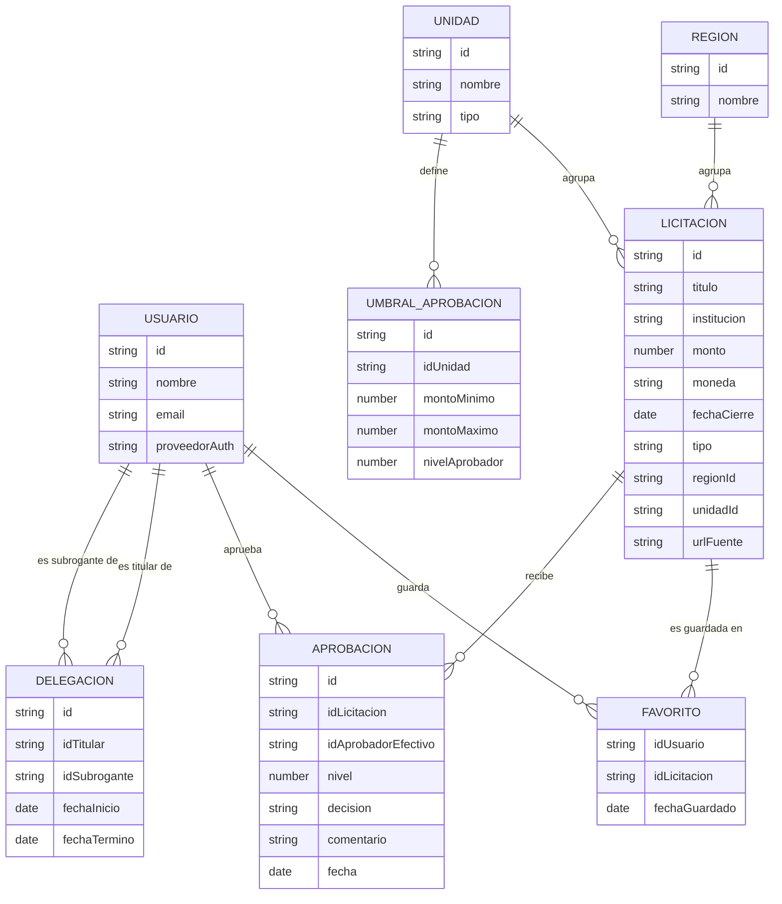

# 🏛️ LicitacionesUV: Plataforma de Filtrado y Centralización de Licitaciones

Plataforma web desarrollada en **React + Vite** diseñada para centralizar, filtrar y optimizar la búsqueda de oportunidades comerciales y licitaciones publicadas por empresas privadas, recopiladas de forma automatizada mediante técnicas de web scraping.

> 🤖 **Para asistentes de IA:** reglas obligatorias de trabajo en [`AGENTS.md`](AGENTS.md) y contexto técnico en [`docs/AI_context.md`](docs/AI_context.md).

---

## 📌 Descripción del sistema

### ¿Qué es?

Es una solución web que reúne en un único punto de acceso las licitaciones y oportunidades de contratación publicadas por diversas empresas privadas. El sistema procesa y categoriza los datos para que proveedores y organizaciones encuentren oportunidades relevantes de manera rápida, accediendo directamente a la fuente oficial de cada convocatoria.

### ¿Qué problema resuelve?

Actualmente, la información de compras y contrataciones privadas se encuentra dispersa en múltiples plataformas y sitios corporativos. Esto genera:

- Pérdida de tiempo en revisiones manuales diarias.
- Riesgo de omitir convocatorias estratégicas con fechas límite próximas.
- Sobrecarga de información no relevante para el rubro específico de cada empresa.

### ¿Cómo funciona?

1. **Recolección:** Un scraper extrae periódicamente los datos públicos de portales autorizados (empresa convocante, fechas de apertura y cierre, rubro, ubicación, bases y enlaces oficiales).
2. **Filtrado y Procesamiento:** La plataforma clasifica las licitaciones por sector, palabras clave, fechas y montos estimados.
3. **Visualización y Gestión:** A través de la interfaz web, el usuario filtra, prioriza y hace seguimiento de las convocatorias que se ajustan a su perfil de negocio.

---

## 🧭 Historias de Usuario

Todas las historias están registradas como GitHub Issues.

| ID    | Nombre                                                | Issue               |
| ----- | ----------------------------------------------------- | ------------------- |
| US-01 | Registrarse en la plataforma                          | #16                 |
| US-02 | Iniciar sesión                                        | #16                 |
| US-03 | Explorar licitaciones publicadas                      | #17                 |
| US-04 | Filtrar licitaciones por palabra clave, región y tipo | #18                 |
| US-05 | Acceder a la fuente oficial de una licitación         | #17                 |
| US-06 | Guardar licitaciones en favoritos                     | #42                 |
| US-07 | Gestionar perfil de usuario                           | — (issue por crear) |
| US-08 | Configurar alertas de nuevas licitaciones             | #48                 |
| US-09 | Aprobar o rechazar una licitación según el monto      | #55 (CR-302)        |
| US-10 | Configurar umbrales de aprobación por unidad          | #56 (CR-302)        |
| US-11 | Gestionar subrogancias con vigencia                   | #57 (CR-302)        |
| US-12 | Buscar licitaciones por palabra clave                 | #43                 |
| US-13 | Ver el detalle de una licitación                      | #44                 |
| US-14 | Asistente guiado de requerimientos de la licitación   | #45                 |
| US-15 | Visualizar favoritas en vistas de calendario y lista  | #46                 |
| US-16 | Mostrar todos los resultados de búsqueda y filtros    | #47                 |
| US-17 | Exportar resumen y bases de licitación en PDF         | #49                 |

> Cada issue mantiene el formato: `US-XX: [nombre]` + enunciado _Como [actor], quiero [acción], para [beneficio]_ + criterios de aceptación (CA1, CA2, ...).

> Los criterios de aceptación de las historias abiertas y su trazabilidad con los requisitos extrafuncionales (REF) están en [docs/CriteriosAceptacion.md](docs/CriteriosAceptacion.md).

---

## 🚦 Requisitos Extrafuncionales

Ver: [ReqExtrafuncionales.md](docs/ReqExtrafuncionales.md)

---

## 🧱 Entidades del Dominio

| Entidad              | Descripción                                                           | Atributos principales                                                                                                                                    |
| -------------------- | --------------------------------------------------------------------- | -------------------------------------------------------------------------------------------------------------------------------------------------------- |
| **Licitación**       | Oportunidad de contratación publicada por un organismo o empresa      | `id`, `título`, `institución convocante`, `monto`, `moneda`, `fecha de cierre`, `tipo` (pública/privada), `región`, `unidad`, `url de la fuente oficial` |
| **Usuario**          | Persona registrada que consulta y sigue licitaciones                  | `id`, `nombre`, `email`, `proveedor de autenticación` (local, Google, GitHub)                                                                            |
| **Favorito**         | Licitación guardada por un usuario para seguimiento                   | `id usuario`, `id licitación`, `fecha de guardado`                                                                                                       |
| **Región**           | División territorial usada para filtrar y categorizar                 | `id`, `nombre`                                                                                                                                           |
| **Unidad**           | Unidad o facultad que agrupa licitaciones y umbrales de aprobación    | `id`, `nombre`, `tipo` (lista predefinida: facultad, dirección, rectoría)                                                                                |
| **Aprobación**       | Decisión de aprobación emitida sobre una licitación                   | `id`, `id licitación`, `id aprobador efectivo`, `nivel`, `decisión`, `comentario`, `fecha`                                                               |
| **Delegación**       | Subrogancia de un titular a un subrogante por un período determinado  | `id`, `id titular`, `id subrogante`, `fecha inicio`, `fecha término`                                                                                     |
| **UmbralAprobación** | Rango de monto que define el nivel de aprobación requerido por unidad | `id`, `id unidad`, `monto mínimo` (inclusivo), `monto máximo` (exclusivo), `nivel aprobador`                                                             |

**Relaciones:**

- Un **Usuario** guarda muchas **Licitaciones** como **Favoritos** (1:N a través de Favorito).
- Una **Licitación** pertenece a una **Región** (N:1).
- Un **Favorito** referencia exactamente a un **Usuario** y a una **Licitación**.
- Un **Usuario** aprueba muchas **Aprobaciones** (1:N).
- Una **Licitación** recibe muchas **Aprobaciones** (1:N).
- Una **Delegación** referencia a dos **Usuarios** (titular y subrogante).
- Un **UmbralAprobación** pertenece a una **Unidad** y define el nivel según rangos de monto.
- Una **Licitación** pertenece a una **Unidad** (N:1).


```mermaid
erDiagram
    USUARIO ||--o{ FAVORITO : guarda
    LICITACION ||--o{ FAVORITO : "es guardada en"
    REGION ||--o{ LICITACION : agrupa
    UNIDAD ||--o{ LICITACION : agrupa
    UNIDAD ||--o{ UMBRAL_APROBACION : define
    USUARIO ||--o{ APROBACION : aprueba
    LICITACION ||--o{ APROBACION : recibe
    USUARIO ||--o{ DELEGACION : "es titular de"
    USUARIO ||--o{ DELEGACION : "es subrogante de"
    USUARIO {
        string id
        string nombre
        string email
        string proveedorAuth
    }
    LICITACION {
        string id
        string titulo
        string institucion
        number monto
        string moneda
        date fechaCierre
        string tipo
        string regionId
        string unidadId
        string urlFuente
    }
    FAVORITO {
        string idUsuario
        string idLicitacion
        date fechaGuardado
    }
    REGION {
        string id
        string nombre
    }
    UNIDAD {
        string id
        string nombre
        string tipo
    }
    APROBACION {
        string id
        string idLicitacion
        string idAprobadorEfectivo
        number nivel
        string decision
        string comentario
        date fecha
    }
    DELEGACION {
        string id
        string idTitular
        string idSubrogante
        date fechaInicio
        date fechaTermino
    }
    UMBRAL_APROBACION {
        string id
        string idUnidad
        number montoMinimo
        number montoMaximo
        number nivelAprobador
    }
```

---

## 🖼️ Mockups

Los mockups de aprobaciones (CR-302) son prototipos HTML de baja fidelidad: se abren directamente en el navegador desde [`docs/mockups/`](docs/mockups/).

| Mockup                                      | Archivo                                                                                                        | Historia de usuario relacionada |
| ------------------------------------------- | -------------------------------------------------------------------------------------------------------------- | ------------------------------- |
| Explorador de licitaciones con tarjetas     | (Figma, por subir)                                                                                             | US-03, US-05                    |
| Panel de filtros lateral                    | (Figma, por subir)                                                                                             | US-04                           |
| Mis favoritos                               | (Figma, por subir)                                                                                             | US-06                           |
| Bandeja de aprobaciones pendientes (CR-302) | [`docs/mockups/CR-302-bandeja-aprobaciones.html`](docs/mockups/CR-302-bandeja-aprobaciones.html)               | US-09, US-11                    |
| Panel de umbrales y subrogancias (CR-302)   | [`docs/mockups/CR-302-panel-umbrales-subrogancias.html`](docs/mockups/CR-302-panel-umbrales-subrogancias.html) | US-10, US-11                    |

---

## 🏗️ Diseño Arquitectónico

Ver: [Arquitectura.md](docs/Arquitectura.md)

La aplicación se construye como una **SPA en React** organizada bajo el enfoque **Feature-Driven** (`src/features/{licitaciones, auth, favoritos}`), con módulos compartidos en `src/shared` y configuración central de rutas en `src/app`.

---

## 👥 Responsabilidades del Equipo

| Integrante                    | Rol                                  | Ítems de la rúbrica a cargo                                                         |
| ----------------------------- | ------------------------------------ | ----------------------------------------------------------------------------------- |
| Wilson Jara (@Wilson-Jara)    | Project Manager / Analista funcional | 1.1 Historias de Usuario (Issues), README.md, coordinación y trazabilidad           |
| Vicente Garcia (@Vixoooooo19) | Tech Lead / Arquitecto de software   | 2.1 Diseño Arquitectónico (Arquitectura.md), 2.2 Diagrama de Arquitectura           |
| Vicente Saa (@Reinald-Code)   | Frontend Developer / UI              | 2.3 Mockups (consistencia con HU)                                                   |
| Benjamin Lazo (@lazo1838k)    | Backend Developer / Integraciones    | 2.4 Entidades del dominio, 1.2 Requisitos Extrafuncionales (ReqExtrafuncionales.md) |
| Mauricio Henriquez (@StelleC) | QA Engineer / DevOps                 | Revisión de coherencia entre artefactos (HU ↔ REF ↔ módulos ↔ mockups)              |

---

## 🚀 Metas y Escalabilidad

- [x] **Fase 1 (Actual):** Interfaz cliente en React + Vite para visualización y filtrado de licitaciones iniciales.
- [ ] **Fase 2:** Integración completa de scrapers automatizados y categorización dinámica por etiquetas.
- [ ] **Fase 3:** Sistema de alertas automáticas por correo para convocatorias de alto interés.
- [ ] **Fase 4:** Panel de estadísticas sobre tendencias de compra por sector y región.

### ⚠️ Limitaciones

- La plataforma depende de la disponibilidad y estructura pública de las fuentes de origen.
- La herramienta centraliza y organiza información, pero no reemplaza la postulación formal en el portal del convocante.

---

## 🛠️ Requisitos Previos

Para ejecutar el entorno local, necesitas:

- **Runtime:** Node.js 20.19+ o 22.12+
- **Gestor de paquetes:** npm 10+
- **Stack principal:** React 19, Vite 8, ESLint 10
- **Pruebas:** runner nativo de Node (`node --test`)
- **Editor recomendado:** Visual Studio Code

### Wrapper y línea base reproducible

Al ser un proyecto Node.js, el equivalente al wrapper `./gradlew` de Gradle es el propio `npm`, complementado con los mecanismos de reproducibilidad del proyecto:

- **`package-lock.json`:** bloquea el árbol de dependencias para installs 100% reproducibles.
- **`engines` en `package.json`:** declara las versiones mínimas de Node.js y npm requeridas.
- **SemVer explícito:** las dependencias se declaran con versión exacta (`19.2.8`, sin rangos `^`/`~`), de modo que todos los entornos usan exactamente la misma versión.

---

## ⚙️ Instalación y Puesta en Marcha

### 1. Clonar el repositorio

```bash
git clone https://github.com/Wilson-Jara/LicitacionesUV.git
cd LicitacionesUV
```

### 2. Validar versión de Node.js

```bash
node --version
npm --version
```

Si tu versión de Node.js es menor a la 20.19, actualízala antes de continuar.

### 3. Instalar dependencias

```bash
npm install
```

### 4. Comando único integrador

El proyecto expone un comando único que **limpia, verifica el formato, compila, prueba y empaqueta** (equivalente a `./gradlew clean build`):

```bash
npm run verify
```

Equivale a ejecutar en secuencia:

```bash
npm run clean        # elimina artefactos de build (dist/)
npm run lint         # análisis estático con ESLint
npm run format:check # verifica el formato unificado (falla si hay desviaciones, ideal para CI/CD)
npm run test         # pruebas con el runner nativo de Node
npm run build        # compilación y empaquetado con Vite
```

### 5. Ejecutar entorno de desarrollo

```bash
npm run dev
```

### Variables de entorno

El proyecto documenta sus variables en `.env.example`. Para configurar tu entorno local:

```bash
cp .env.example .env
```

- Cada variable está documentada con su **nombre**, **formato** y **obligatoriedad** dentro de `.env.example`.
- Los archivos `.env` reales nunca se suben al repositorio (excluidos por `.gitignore`), igual que certificados y llaves privadas (`*.pem`, `*.key`, `*.p12`, `*.pfx`).

---

## Formateo de código

El proyecto utiliza [Prettier](https://prettier.io/) para mantener un formato consistente en los archivos compatibles.

### Formatear archivos

Para aplicar automáticamente el formato:

```bash
npm run format
```

### Verificar el formato

Para comprobar que los archivos ya estén formateados sin modificarlos:

```bash
npm run format:check
```

### Configuración

La configuración se encuentra en:

- `.prettierrc`: reglas de formato del proyecto.
- `.prettierignore`: archivos y carpetas excluidos del formateo.

Antes de crear un Pull Request, ejecuta:

```bash
npm run verify
```

El comando `verify` ya incluye la verificación de formato (`format:check`), por lo que el build falla si algún archivo no cumple el formato unificado del equipo.

El formateo no debe cambiar la lógica de la aplicación, únicamente la presentación del código.

---

## 🌿 Flujo de Trabajo en Git

El proyecto usa un modelo de ramas con dos ramas permanentes:

- **`main`**: rama de producción. Contiene únicamente versiones estables y verificadas. Está protegida: nadie trabaja sobre ella directamente.
- **`develop`**: rama de integración. Aquí convergen todas las funcionalidades terminadas y revisadas. Es la base desde la que se crean todas las ramas de trabajo.

```text
main      ──────■────────────────■──────►  (solo merges de release/hotfix)
                ▲                ▲
develop       ──■──■────■───────■──────►  (integra features vía PR)
                  ▲  ▲
feat/41-…   ───────■──■──────────────►  (ramas de trabajo)
```

### Gestión de Ramas

Nunca trabajes directo sobre `main` ni sobre `develop`. Toda tarea (Issue) se desarrolla en su propia rama, creada **siempre desde `develop`**:

```bash
git checkout develop
git pull
git checkout -b feat/[numero-issue]-[descripcion-corta]
```

Convención de nombres según el tipo de tarea:

| Tipo     | Uso                                     | Ejemplo                        |
| -------- | --------------------------------------- | ------------------------------ |
| `feat/`  | Nueva funcionalidad                     | `feat/41-modo-oscuro-claro`    |
| `fix/`   | Corrección de un bug                    | `fix/25-filtro-fecha-invalido` |
| `docs/`  | Documentación                           | `docs/30-actualizar-readme`    |
| `chore/` | Tareas de mantenimiento o configuración | `chore/8-actualizar-gitignore` |

### Registro de Cambios (Commits)

Usa mensajes atómicos e imperativos que describan el efecto del cambio, no el archivo modificado:

```bash
git add .
git commit -m "Agrega boton de alternancia de tema oscuro y claro"
```

### Publicación y Pull Request

Publica la rama y abre el Pull Request **hacia `develop`** (nunca hacia `main`):

```bash
git push -u origin feat/[numero-issue]-[descripcion-corta]
```

El PR debe incluir: propósito, resumen de cambios, cómo se verificó y el Issue que cierra:

```text
Closes #[número_issue]
```

> **Regla:** El Pull Request requiere la revisión y aprobación de al menos otro integrante del equipo antes del merge. El autor nunca aprueba su propio PR.

### Verificación automática y protección de ramas

El repositorio aplica controles automáticos para que ningún cambio llegue a las ramas permanentes sin validación:

- **Integración continua (CI):** el workflow `.github/workflows/verify.yml` ejecuta `npm run verify` en cada Pull Request hacia `main` y `develop`. Si lint, formato, pruebas o build fallan, el PR queda bloqueado.
- **Protección de ramas:** `main` y `develop` exigen al menos **1 aprobación de un revisor distinto del autor** y el estado de CI en verde antes del merge.
- **Asignación de revisores (CODEOWNERS):** `.github/CODEOWNERS` solicita automáticamente la revisión de los responsables del área que toca cada PR (detalle en [Asignación del revisor](#asignación-del-revisor)).
- **Plantilla de Pull Request:** `.github/pull_request_template.md` recuerda completar propósito, resumen, cómo se verificó y el issue que cierra.
- **Plantillas de issues:** `.github/ISSUE_TEMPLATE/` incluye historia de usuario, tarea/chore y bug, con _Definition of Ready_ (DoR) y _Definition of Done_ (DoD).
- **Revisor automático (IA):** el workflow `.github/workflows/ai-review.yml` publica un comentario con la revisión de DeepSeek (`.github/scripts/ai-review.mjs`) al abrir o reabrir un PR/issue y, bajo demanda, al agregar la etiqueta `ai-review`. Redacta secretos antes de enviar el contenido al modelo y responde en español. Requiere el secret `DEEPSEEK_API_KEY`; si no está configurado, la revisión se omite sin bloquear el CI.

> **Regla:** no se fusiona un PR sin revisión de un par y sin que `npm run verify` pase en CI. La revisión automática de IA es una **sugerencia**: no reemplaza la revisión ni la aprobación humana.

### Asignación del revisor

El revisor no se define como _assignee_ del issue (ese rol corresponde a quien implementa), sino que se registra en dos lugares:

- **En el tablero (planificación):** el Project incluye un campo personalizado **"Revisor"** donde se indica qué integrante revisará la entrega.
- **En el Pull Request (ejecución):** al abrir el PR, GitHub **asigna automáticamente** los revisores según [`.github/CODEOWNERS`](.github/CODEOWNERS); si hace falta, también se puede solicitar a mano en el panel **Reviewers**.

El revisor debe ser **distinto del autor**: GitHub no permite aprobar el PR propio y la protección de rama exige al menos 1 aprobación de un par.

#### CODEOWNERS

El archivo [`.github/CODEOWNERS`](.github/CODEOWNERS) mapea cada área del repositorio a sus responsables (ver [docs/roles-equipo.md](docs/roles-equipo.md)), de modo que GitHub propone al revisor adecuado según los archivos que toca cada PR, sin tener que agregarlos a mano.

- **Alcance:** como los PR se abren hacia `develop`, el `CODEOWNERS` se aplica desde la **rama base** del PR; debe estar fusionado en `develop` para surtir efecto.
- **Aplicación:** para _exigir_ la aprobación de un code owner (no solo sugerirla), hay que activar **Require review from Code Owners** en la protección de `main` y `develop`.
- **Revisión cruzada:** cada área tiene al menos **dos responsables**, de modo que siempre exista un revisor distinto del autor.

### ¿Cuándo se fusiona `develop` hacia `main`?

La integración de `develop` → `main` **no ocurre con cada feature**. Solo se realiza cuando el equipo decide cerrar una **versión entregable** (por ejemplo, al término de un hito de evaluación o un corte de sprint). El procedimiento es:

1. Verificar que `develop` está estable y que `npm run verify` pasa completo.
2. Abrir un Pull Request `develop` → `main` con un resumen de todo lo integrado desde el último corte.
3. Revisión de al menos otro integrante que no participó en los cambios a integrar.
4. Merge a `main` y, si corresponde, crear un tag de versión (`git tag -a v0.X.0 -m "..."`).
5. Mantener `develop` como base de trabajo para el siguiente ciclo.

Para correcciones urgentes detectadas en producción se crea una rama `hotfix/[descripcion]` **desde `main`**, se integra a `main` y luego se sincroniza con `develop` (`git checkout develop && git merge main`).

---

## Fundamentos de Ingeniería de Software

### Actividad · Diagnóstico de madurez, caso equipo Aurora

En parejas · 10 minutos. Calificar las áreas de proceso con la escala N · P · L · F (ISO/IEC 33000) citando evidencia del caso, y luego ubicar el nivel de madurez del equipo. La regla de la actividad: se califica lo que **está registrado**, no lo que el equipo probablemente hace.

### Gestión de requisitos — P

Tienen las 9 historias de usuario en el tablero, o sea no es que no existan, pero solo 3 tienen criterio de aceptación y los cambios los resuelven conversando en la reunión, nada queda escrito. La práctica está a medias.

### Planificación del proyecto — P

Sí planifican: sprints de 2 semanas con fecha fija, eso está. Lo débil es que asignan la carga "a ojo" en la reunión de inicio, sin mirar cuánto se demoraron en los sprints anteriores. Planifican, pero sin datos.

### Gestión de la configuración — L

De las 4 áreas es la mejor. Todo el código está en Git y versionado, así que hay control. Igual le falta: no hay convención para los mensajes de commit ni etiqueta de versión, o sea si les preguntan "qué versión entregaron" no sabrían señalarla.

### Verificación — N

Prueban manualmente antes de cada demo, pero no hay ni un caso de prueba escrito ni registro de qué se probaron. Como hay que calificar lo que está registrado y no lo que uno supone que hicieron, aquí no hay evidencia de nada: va N.

### ¿En qué nivel está el equipo?

Lo ubicamos en **nivel 1 (Inicial)**. Entregaron las 4 iteraciones pero a pura pasada, y de hecho las últimas 2 demos se atrasaron y el equipo lo echa a los "cambios de último minuto", o sea responden con sobreesfuerzo y no con proceso. Tienen cosas del nivel 2 empezadas (tablero, sprints, Git, actas), pero ninguna terminada, falta el registro y la trazabilidad. Lo que más les falta para subir a nivel 2: criterios de aceptación en todos los requisitos, registrar los cambios, identificar la versión que entregan y dejar constancia de las pruebas.

### Actividad · Parte 2: Propuesta de mejora para nivel 2

En parejas · 12 minutos. Propuesta de dos acciones para llevar a Aurora hacia el Nivel 2 de madurez (Gestionado), atacando brechas distintas, sin comprar software ni sumar personas, y con indicadores calculables con los registros existentes del equipo.

### Propuesta de mejoras (Tabla de acciones)

| Campo                   | Acción 1 (Gestión de Configuración y Calidad)                                                                                                                                                                     | Acción 2 (Gestión de Requisitos y Control)                                                                                                                                                                      |
| ----------------------- | ----------------------------------------------------------------------------------------------------------------------------------------------------------------------------------------------------------------- | --------------------------------------------------------------------------------------------------------------------------------------------------------------------------------------------------------------- |
| **Brecha**              | Los cambios en código/documentación se integran sin validación ni revisión previa, generando fallos en producción y desorden en el repositorio.                                                                   | Las tareas se inician e implementan sin criterios de aceptación ni requisitos claros, produciendo retrabajo e incertidumbre en las entregas.                                                                    |
| **Acción**              | Establecer **reglas de protección de rama (`main`)** en GitHub exigiendo aprobación de al menos un par y ejecución de la suite de pruebas (`npm run verify`) antes de consolidar cambios.                         | Implementar una **plantilla estandarizada de tareas/issues** que exija definir la _Definition of Ready_ (DoR: criterios de aceptación) y _Definition of Done_ (DoD: verificación de QA) para cada tarea.        |
| **Responsable y plazo** | **Tech Lead / QA**, Plazo: 3 días                                                                                                                                                                                 | **Project Manager / Analista**, Plazo: 5 días (1 semana)                                                                                                                                                        |
| **Evidencia esperada**  | • Regla de _Branch Protection_ activa en el repositorio.<br>• Plantilla de Pull Request (`pull_request_template.md`) con _checklist_ de verificación.                                                             | • Plantilla oficial de tareas en `.github/ISSUE_TEMPLATE/`.<br>• Tablero de proyecto (Kanban) con tareas que incluyen criterios de aceptación y DoD antes de iniciar.                                           |
| **Indicador**           | **Tasa de integraciones seguras:** Medido como la cantidad de PRs fusionados que contaron con aprobación previa de un par y pruebas pasadas, sobre el total de PRs del sprint (extraído del historial de GitHub). | **Tasa de entregas sin retrabajo:** Medido como la cantidad de tareas cerradas que cumplieron los criterios de aceptación al primer intento sin ser reabiertas por errores (extraído del estado de los Issues). |

### Cumplimiento de condiciones

- **Brechas distintas:** La Acción 1 aborda la Gestión de Configuración y Calidad de Integración del software, mientras que la Acción 2 aborda la Gestión y Control de Requisitos del proyecto.
- **Sin compras ni personal nuevo:** Ambas acciones operan al 100% sobre la infraestructura existente de GitHub, plantillas Markdown y scripts del repositorio (`npm run verify`).
- **Indicadores calculables:** Los indicadores se obtienen directamente de los registros nativos de GitHub (historial de Pull Requests e Issues).

### Actividad · Taller de arquitectura: priorización ISO 25010

Trabajo en clases sobre el proyecto del grupo. El taller tiene tres fases y culmina en un bosquejo arquitectónico defendible: **Fase 1** priorizar los atributos ISO 25010, **Fase 2** decidir el estilo arquitectónico, el _trade-off_ y los ASR, y **Fase 3** poner en común el bosquejo.

### Fase 1 · Atributos (10 min)

Del catálogo ISO 25010 se marcaron los atributos que aplican a LicitacionesUV y se les asignó prioridad. El equipo acordó que **solo tres atributos** serían de prioridad Alta, eligiendo las condiciones críticas del producto, que coinciden con los REF de mayor prioridad documentados en [`docs/ReqExtrafuncionales.md`](docs/ReqExtrafuncionales.md).

| Atributo          | Pregunta guía para el sistema                         | Prioridad |
| ----------------- | ----------------------------------------------------- | --------- |
| Rendimiento       | ¿Cuántos usuarios simultáneos? ¿Hay tiempos críticos? | **Alta**  |
| Seguridad         | ¿Hay datos sensibles? ¿Quién accede a qué?            | **Alta**  |
| Fiabilidad        | ¿Puede caerse? ¿Por cuánto tiempo sin daño?           | **Alta**  |
| Mantenibilidad    | ¿Con qué frecuencia cambiará? ¿Rotará el equipo?      | Media     |
| Usabilidad        | ¿Qué tipo de usuario? ¿Necesita entrenamiento?        | Media     |
| Interoperabilidad | ¿Debe integrarse con otros sistemas o APIs?           | Media     |

#### Justificación de las prioridades

- **Rendimiento (Alta) — REF-01.** El explorador es el flujo principal y debe filtrar en menos de 2 segundos. Hoy el conjunto de datos es mock, por lo que el número de usuarios simultáneos aún no es medible; el criterio crítico por ahora es el tiempo de respuesta.
- **Seguridad (Alta) — REF-02 y REF-03.** Aunque el contenido de las licitaciones sea público, existen cuentas de usuario (login/registro), acciones privadas (guardar favoritos) y secretos de configuración; además el flujo de aprobaciones exige control de acceso por roles (REF-14 a REF-16).
- **Fiabilidad (Alta) — REF-04.** El sistema debe estar disponible al menos el 99 % en horario laboral. En esta fase (SPA estática con mocks) se respalda con `npm run verify` y la estabilidad del build; la disponibilidad se vuelve plenamente medible en la Fase 2, con el scraper/API real.
- **Mantenibilidad (Media) — REF-06.** La arquitectura Feature-Driven y la rotación del equipo importan, pero no son una condición que rompa el producto; se sostienen con ESLint, convenciones y bajo acoplamiento.
- **Usabilidad (Media) — REF-05.** El usuario es público general y empresas, sin entrenamiento previo, por lo que la interfaz debe ser intuitiva, responsive y con estados de carga, vacío y error; es importante, pero no bloqueante como las condiciones críticas.
- **Interoperabilidad (Media).** La integración con el scraper/API real es clave para la Fase 2 (REF-10), pero hoy no aplica porque los datos son mock; es una restricción técnica de evolución más que una condición crítica actual.

> **Trade-off de priorización:** se evaluó dejar Interoperabilidad en Alta, pero con solo tres cupos se priorizaron las condiciones críticas del producto. Si la integración con fuentes externas pasa a ser bloqueante, se intercambiaría por Fiabilidad.

### Fase 2 · Decisión arquitectónica

#### Decisión 1 · Estilo principal

**Estilo elegido: Monolito modular en capas (Feature-Driven).**

De la tabla _Del atributo al estilo_, la fila que aplica es **Simplicidad y time-to-market → Monolito en capas**. Los estilos distribuidos se descartan porque sus atributos gatillantes no están en Alta y, además, degradan los tres atributos críticos del proyecto.

| Estilo de la tabla    | Atributo que lo gatilla  | Se descarta porque…                                                                    |
| --------------------- | ------------------------ | -------------------------------------------------------------------------------------- |
| Microservicios        | Escalabilidad por partes | Nuestro Alta no es escalabilidad; agrega red y despliegue.                             |
| Event-Driven          | Desacoplamiento          | Nuestro Alta no es desacoplamiento; la trazabilidad de un flujo se vuelve más costosa. |
| REST / Servicios      | Interoperabilidad        | Interoperabilidad quedó en Media; es complemento, no estilo global.                    |
| Capas                 | Mantenibilidad           | Mantenibilidad quedó en Media; aporta, pero no es el driver.                           |
| **Monolito en capas** | **Simplicidad / TTM**    | **Elegido:** no sacrifica Rendimiento, Seguridad ni Fiabilidad.                        |

**Justificación atada a los atributos críticos (Alta):**

- **Rendimiento (REF-01).** El filtrado ocurre en el cliente (<2 s); no hay saltos de red que agregar. Microservicios solo sumarían latencia.
- **Seguridad (REF-02/03).** Un solo desplegable = una única superficie de autenticación/autorización; distribuir multiplica los canales internos que habría que proteger y auditar.
- **Fiabilidad / Disponibilidad (REF-04).** Menos componentes = menos fallos parciales, timeouts y particiones de red; distribuir **reduce** la disponibilidad alcanzable.

#### Decisión 2 · Trade-off

De la última columna de la tabla _Del atributo al estilo_, lo que se cede al elegir **Monolito en capas** es **escalar las partes por separado** más adelante.

| Se gana                                                   | Se cede                                                       |
| --------------------------------------------------------- | ------------------------------------------------------------- |
| Simplicidad y time-to-market.                             | Escalabilidad independiente por módulo.                       |
| No sacrifica Rendimiento, Seguridad ni Fiabilidad (Alta). | Escalar una parte obliga a escalar todo el desplegable junto. |

**Por qué se acepta:** hoy no hay carga real ni equipos separados que justifiquen escalar por partes. La **capa de datos aislada dentro del monolito** cubre la restricción de evolución (reemplazar mocks por scraper/API real sin rediseñar módulos, REF-10).

#### Decisión 3 · Componentes

Los grandes bloques del sistema, en orden, con la notación **componente · conector · interfaz**:

1. **App** — composición. _Conector:_ navegación / montaje de rutas. _Interfaz:_ árbol de rutas y `AuthProvider`.
2. **Auth** — sesión del usuario. _Conector:_ contexto React. _Interfaz:_ `useAuth` (sesión, login, logout, registro) y `AuthModal`.
3. **Licitaciones** — explorar, listar y filtrar. _Conector:_ hook + props. _Interfaz:_ `useLicitacionFilters`, `LicitacionCard`/`LicitacionList`, `FilterSidebar` y contrato de licitación.
4. **Favoritos** — guardar y revisar licitaciones. _Conector:_ hook + consulta de sesión. _Interfaz:_ `MisFavoritosPage`.
5. **Aprobaciones** — nivel de aprobación y aprobador efectivo. _Conector:_ consulta de monto + sesión + config. _Interfaz:_ consulta "quién aprueba y en qué nivel" y registro de decisiones.
6. **Shared** — UI transversal. _Conector:_ props. _Interfaz:_ `Navbar` y UI común sin lógica de dominio.
7. **Configuración** — umbrales y subrogancias (datos). _Conector:_ lectura de datos. _Interfaz:_ umbrales por unidad y delegaciones.
8. **Fuente de datos** — licitaciones. _Conector:_ contrato de datos estable. _Interfaz:_ `licitaciones.mock.json` (Fase 2: scraper/API con el mismo contrato).

Conexiones principales (origen —conector→ destino):

1. `App —rutas→ Licitaciones / Favoritos / Aprobaciones`.
2. `Favoritos y Aprobaciones —consulta de sesión→ Auth`.
3. `Aprobaciones —monto→ Licitaciones` y `Aprobaciones —umbrales/delegaciones→ Configuración`.
4. `Licitaciones y Favoritos —contrato de datos→ Fuente de datos`.
5. `Shared —estado de sesión→ Auth`.

**Regla de acoplamiento:** los bloques se comunican solo por interfaces explícitas (hooks y props); ningún feature accede a los internos de otro.

#### Decisión 4 · ASR

**ASR (según la plantilla):** «El sistema debe **responder** _(atributo: Rendimiento)_ bajo **el catálogo completo de licitaciones** _(condición)_, medido por **el tiempo de respuesta del listado filtrado, ≤ 2 s** _(métrica)_.»

Es arquitectónicamente significativo porque cumple las **tres señales**:

1. **Afecta a varios módulos a la vez:** Licitaciones (filtros y lista) y la capa de datos (debe entregar el catálogo completo); Favoritos reutiliza el mismo listado.
2. **Es caro de revertir si se decide tarde:** asumir filtrado en el cliente ata el stack (SPA) y el contrato de datos; pasar después a búsqueda en servidor exige backend, índices y rediseño.
3. **Nace de un atributo de calidad, no de una función:** es **Rendimiento (REF-01)**, no "agregar un filtro".

**Cómo obliga a estructurar:** filtrado en el cliente (`useLicitacionFilters`) sobre un catálogo cargado localmente, sin round-trips por cada interacción; refuerza la SPA estática y la **capa de datos aislada** con contrato estable (REF-10).

> **Alternativa evaluada:** la sustitución mock → scraper/API real (REF-10) también cumple las tres señales, pero se documenta como **restricción de evolución** (Decisión 2, Decisión 3) porque su gatillante es una restricción técnica, no un atributo de calidad.

## Registro de Prompts e Iteraciones con IA

## Prompt:

> Ayúdame a escribir la descripción de mi proyecto de software. Se llama filtrado de licitaciones de empresas privadas y lo que hace es con un scraper recolecta los datos de las páginas donde se suben estas licitaciones, hace un filtrado de estas mismas y las publica en una web. ¿Puedes hacer una primera versión?

## Respuesta IA:

> Este proyecto automatiza la búsqueda y selección de licitaciones publicadas por empresas privadas. Mediante un scraper, recopila información de distintas plataformas y páginas web donde se anuncian estas oportunidades. Posteriormente, los datos son procesados y filtrados según criterios definidos, para mostrar únicamente las licitaciones más relevantes. Finalmente, la información seleccionada se publica en una plataforma web, facilitando su consulta y seguimiento.

## Prompt:

> Escribe una versión más detallada en la cual se vea el problema del cliente, cómo llevar este problema a una web y la solución que daría este proyecto.

## Respuesta IA:

> Las empresas y profesionales que buscan nuevas oportunidades comerciales suelen enfrentarse a un problema: la información sobre licitaciones privadas se encuentra distribuida en múltiples páginas web, plataformas y portales de contratación. Revisar manualmente todas estas fuentes requiere mucho tiempo, dificulta detectar nuevas oportunidades y puede provocar que algunas licitaciones importantes pasen desapercibidas.
>
> Este proyecto propone desarrollar una plataforma web capaz de centralizar, organizar y filtrar esta información de forma automatizada. Para ello, el sistema utiliza un scraper que consulta periódicamente las páginas donde se publican licitaciones de empresas privadas y recopila datos relevantes como el nombre de la empresa convocante, el título de la licitación, la descripción, la fecha límite, la categoría, la ubicación y el enlace a la publicación original.

## Prompt:

> Ten en cuenta que esta descripción tiene que leerla nuestro cliente pero no de forma técnica. En esta debes explicar qué tan escalable es este programa y cuáles son las limitaciones, qué es, para quién es, qué problema resuelve, etc.

## Preguntas del PPT:

> **¿Qué es?** Es una plataforma web que reúne en un único lugar las licitaciones y oportunidades de contratación publicadas por empresas privadas.
>
> **¿Qué problema resuelve?** Centraliza información dispersa, ahorra tiempo de búsqueda y reduce el riesgo de perder convocatorias relevantes.
>
> **¿Para quién está pensado?** Empresas proveedoras de productos/servicios, consultoras y equipos de desarrollo de negocio que participan activamente en compras privadas.
>
> **Escalabilidad y Limitaciones:** Permite sumar nuevas fuentes y módulos de alertas de forma modular; depende de la disponibilidad de portales abiertos y no sustituye la postulación final.
